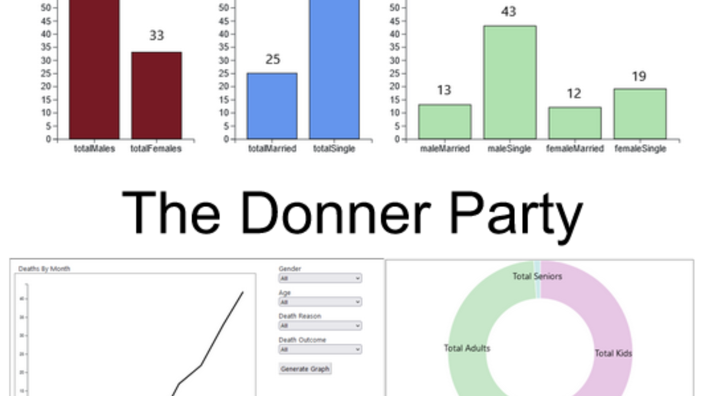
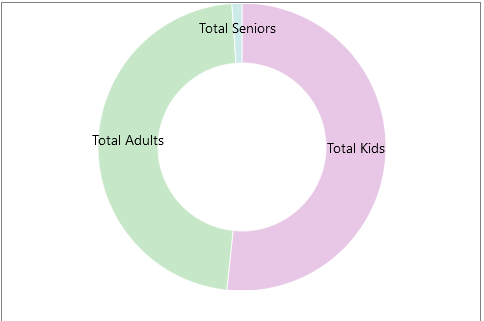
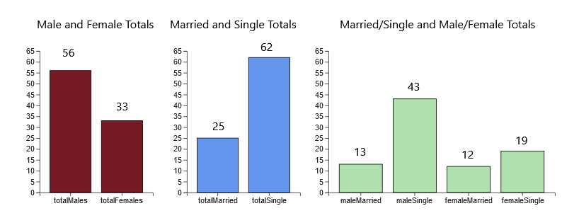
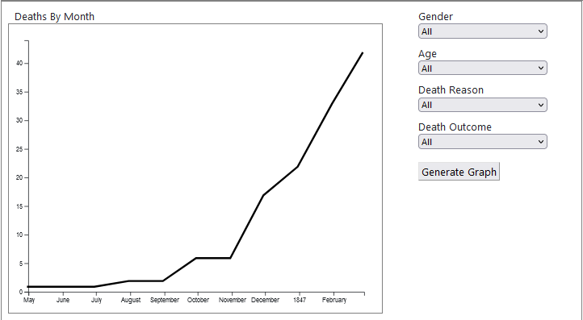
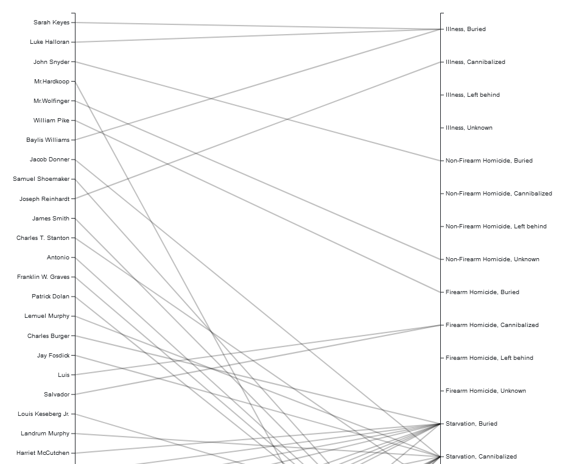
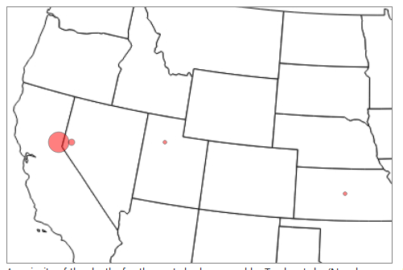

# **CSE 494 Course Project**

Members:

Damon Williams, dcwill15@asu.edu, 1216794124     
Guadalupe Higuera, ghiguer1@asu.edu, 1207649842    
Vincent Sin, vsin1@asu.edu, 1218336379        
Alexander Wong, acwong7@asu.edu, 1217535761

**Overview:**

The Donner Party was a famous group of American emigrants in the 1840s who aimed to settle westward in the region we now call California and Oregon.  Unfortunately the group was advised to take a shortcut, which next to no one had dared to travel. This path would take a tremendous toll on the party in various forms. The aim of this project is to chronicle the events of the Donner Party's famous voyage and provide neat and concise statistics of the demographics, timeline, and eventual fates of the members of The Donner Party. 

**Data Description:**
https://www.kaggle.com/datasets/morales2018/donner-party
Enclosed is a link to The Donner Party csv used to create the following system. The csv contains a list of every member of the donner party, as well as relevant information to each member. Relevant information includes, name, sex, age, and marital status
https://en.wikipedia.org/wiki/Donner_Party_timeline#Mortality_summary
Enclosed is a link to the Donner Party timeline csv. This csv contains the information regarding the members who died on the expedition. 

**Goals and Tasks:**

Because our dataset consisted of a series of people and events over a set period of time we’re able to delve deep into their actions and outcomes over this period of time. The most intriguing task that users will be prompted with by our visualizations will be the analysis of the party. Because we were able to acquire this complex of a dataset we were able to create many visualizations that allow the users to analyze different aspects of the party at multiple time points.

**Idioms:**

The interface we’ve chosen to build is a statistical chronicle of the members of The Donner Party and their collective outcome. 
This visualization allows users to analyze The Donner Party and explore the wide variety of outcomes for varying demographics of The Donner Party. 
Our first  visualization is a pie chart, this chart shows the distribution of age groups across the party. 

This felt adequate since the groups we’re splitting the data into are percentages of whole and a pie chart is great at displaying percentages. 
The second visualization we have is a bar chart which depicts the marital status of the party.  

We felt this was an adequate visualization because we’re able to easily compare side by side each marital status demographic. 
Next is a line graph which is a timeline of the deaths the party ensued over the course of their expedition.  

This graph allows users to filter by certain statistics, like gender, age, and death reason. 
This is an especially interesting graph because it allows users to interact and visualize the different trends for 
different demographics over the course of the expedition. Next we have a visualization that links each member of the party to a specific outcome.

This graph allows users to map groups of members of the donner party to certain outcomes, it also includes an interactive component where you can sort by just the members who died. 

This graph depicts a map and each blip on the map shows where an individual died, for points where multiple individuals died the corresponding bubble grows in size

**Reflection:**

The conversion of this project from Initial proposal to WIP was incredibly simple, our initial set of tasks were to create an outline of the project. This allowed us to designate certain spaces for each of the SVG’s as well as the text descriptions, css, and js files. Starting the project off like this allowed us to simultaneously work on the project without worrying about creating conflicts. After we had this outline done we started working on the implementations, the first 4 implementations were straight forward for our team and well within the scope of what we had anticipated. The final two, however, were a bit more complex and time consuming than we had anticipated. Our innovative view, in particular, has seen some revisions since the proposal because we felt it was a tad too complex for the time we had to complete the project. We’ve simplified that view down to a degree but it should still have a similar function to what we originally intended. If we had to do the project over again I would say that we would do 6 visualizations that are more conventional, and make a 7th innovative view as a stretch goal if we have time, in order to alleviate some of the pressure. 

**Team Worked:**

The Pie Chart was completed by Damon, as well as the initial outline of the project. Wip Documentation, and Final Write Up were also greatly contributed to by Damon.
The Innovative view was completed by Guadalupe. Guadalupe also made great contributions to the WIP Documentation and Poster. 
The Bubble map was completed by Vincent with some help from Guadalupe. 
Alexander completed the Bar chart, Line Graph, and Slope Graph.
